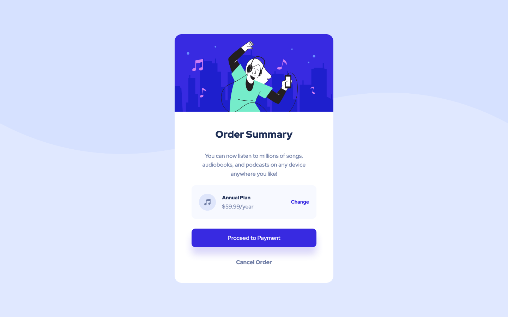
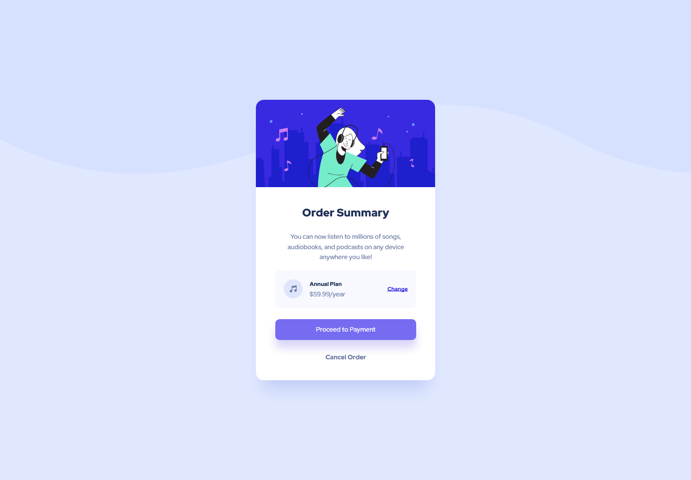

# Mobile First Responsive Order Sumamry Component

## Table of contents

-   [Overview](#overview)
    -   [The challenge](#the-challenge)
    -   [Screenshots](#screenshots)
    -   [Links](#links)
-   [My process](#my-process)
    -   [Built with](#built-with)
    -   [What I learned](#what-i-learned)
    -   [Continued development](#continued-development)
    -   [Useful resources](#useful-resources)
-   [Author](#author)
-   [Acknowledgments](#acknowledgments)

## Overview

### The challenge

This was another component card to reinforce my understanding of flexbox and css stylings using scss as a preprocessor.

Users should be able to:

-   See hover and focus states for interactive elements

### Screenshots

Dekstop View



Active View



Mobile View


### Links

-   Solution URL: [Github](https://github.com/NicholasAnich/NFT-Card-Component)
-   Live Site URL: [Netlify Page](https://tranquil-conkies-de56ab.netlify.app/)

## My process

### Built with

-   Semantic HTML5 markup
-   CSS custom properties
-   Flexbox
-   Mobile-first workflow

### What I learned

Transistions were pretty fun to mess around with. I didn't do anything fancy just a simple transition of color on links.

```css
&__btn {
    display: block;
    text-align: center;
    margin-bottom: 1.5em;
    color: white;
    background-color: $btnBlue;
    border-radius: 11px;
    box-shadow: 0px 20px 20px rgba(56, 42, 225, 0.190291);
    transition: background-color 200ms ease-in-out;
    @include breakpoints-up(med) {
        margin-bottom: 2em;
    }
}
&__btn:hover,
&__btn:focus {
    background-color: $hoverPurple;
}
```

There was also the issue where I was setting set widths on certain elements in the content area. More specifically the payment and cancel buttons. Forgetting that anchor tags are inline to get them to take up the full width without have to set a width I simply made them display: block. 🤣

```css
&__cancel {
    display: block;
    font-weight: 900;
    color: $fontBlue;
    text-align: center;
    transition: color 100ms ease-in-out;
}
```

### Continued development

Clean up and refactor any uneeded HTML or CSS.

### Useful resources

-   [Transition - css-tricks](https://css-tricks.com/almanac/properties/t/transition/) - Good overview of how to use transitions.

## Author

-   Frontend Mentor - [@NicholasAnich](https://www.frontendmentor.io/profile/yourusername)
-   GitHub - [@NicholasAnich](https://github.com/NicholasAnich)

## Acknowledgments

This is a solution to the [Order summary card challenge on Frontend Mentor](https://www.frontendmentor.io/challenges/order-summary-component-QlPmajDUj).
